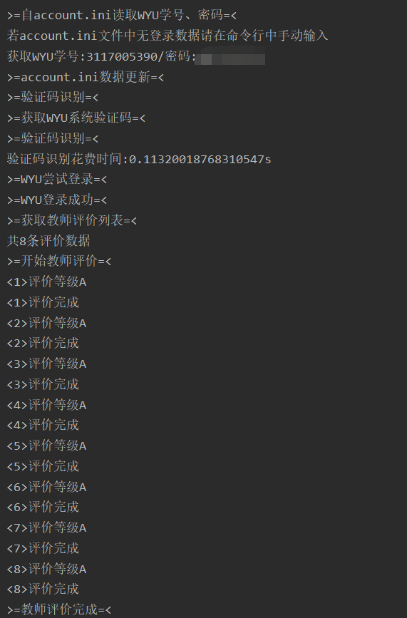
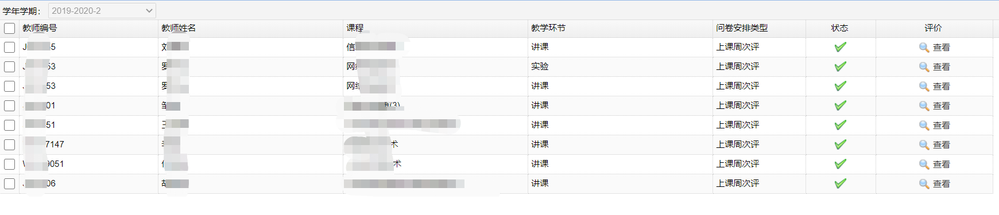
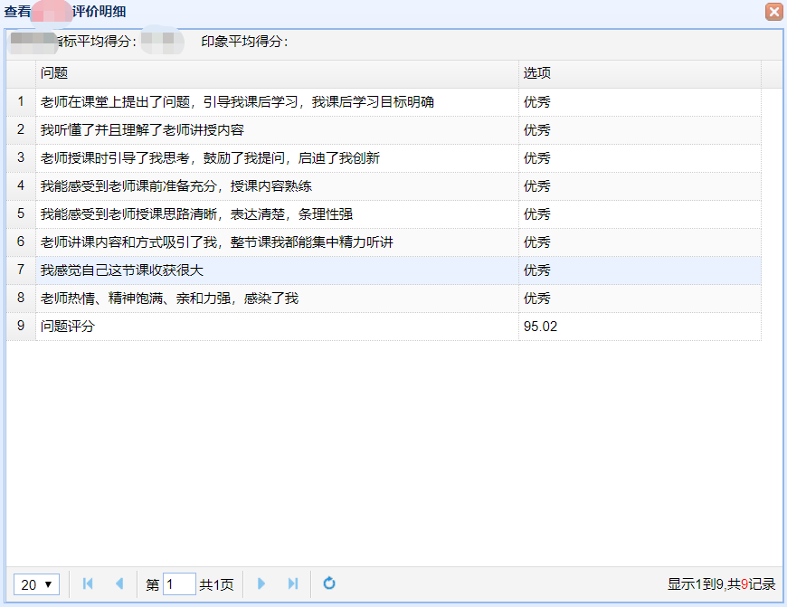

一键自动完成教师评价
------
*写入账号密码后，自动识别验证码并进行登录，随后自动完成教师评价*  
*author: afeng*  
*date: 2020/07/12*  
***脚本涉及的验证码识别部分系Jorver开发，暂不公布***

环境说明
* 编写环境  
python3.6

脚本说明  
该脚本应用于每学期末对各位老师进行自动评价 
 
教师评价系统中，根据不同老师授予的课程教学环节不同，评价内容不同。  
* V1.0 2019/06/12 手动输入验证码
* V2.0 2020/07/12 自动识别验证码，自动化、模块化优化

当前已适应评价的教学环节包括
- [x] 讲课
- [x] 实习
- [x] 体育
- [x] 上机
- [x] 实验
- [ ] 未知 

当前对教师评价等级包括
- [x] 优秀（95.02） 默认
- [x] 良好（85.02）
- [x] 中等（75.02）
- [ ] 及格
- [ ] 不及格

 Run
---
运行脚本
```
    python3 ./main.py
```

修改评价等级
* 若直接运行，则评价等级为"A"，即优秀，总评分95.02
* 可修改评价等级，当前包括三个评价等级: A B C，即优秀、良好、中等  
操作如下(直接修改main.py文件中的level变量值)
```
    Evaluate(os.path.dirname(__file__), level='A').evaluate()
```

效果
---
使用说明  
* 以Windows 10下PowerShell终端使用进行说明  
* 完成操作，等待脚本自动进行教师评价  


效果说明  
* 脚本按照程序预设进行教师评价，点击查看与正常提交操作无异！
* 对老师默认评价为优秀（总分95.02）、意见为空


